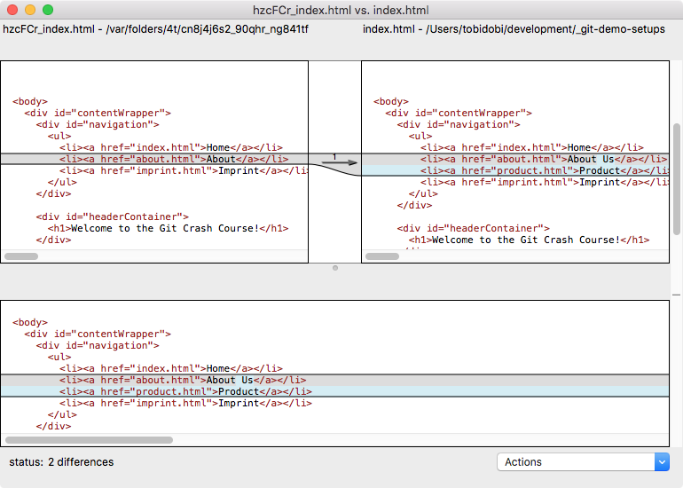
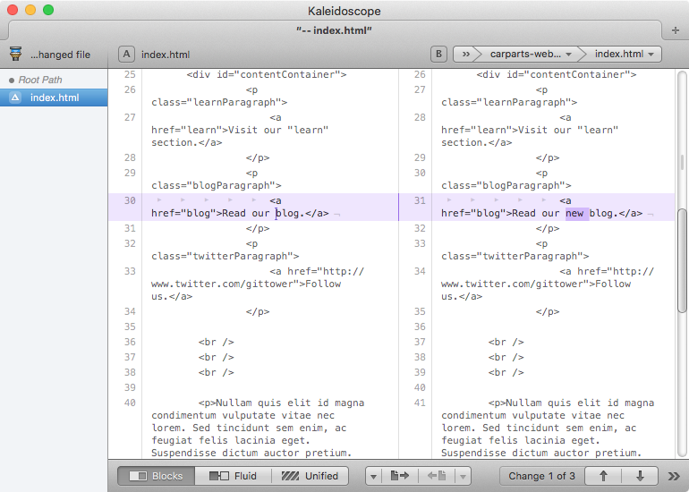
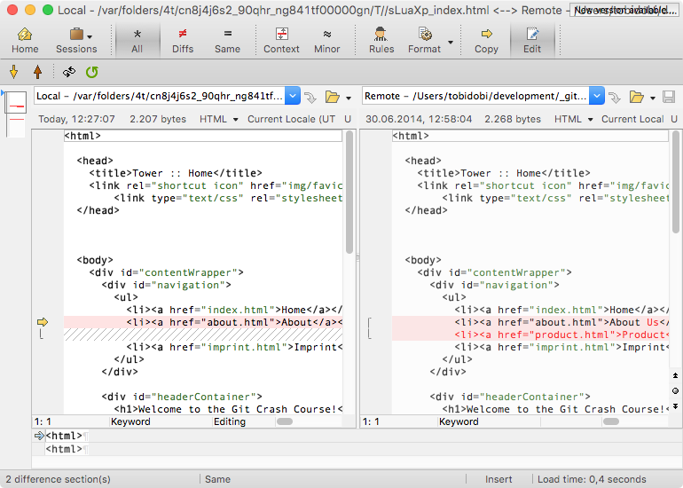
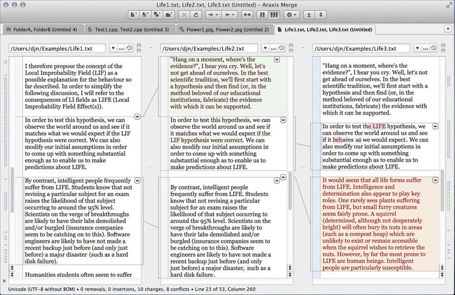
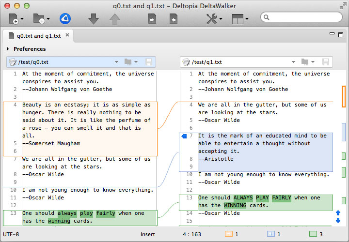

# Apps

Here is a list of apps that are generally good to use and can come in handy in day to day tasks. The apps are separated into 4 broad categories _Developer Tools_, _Productivity Tools_, _Office Apps_ and _Other_.

## Development Tools

- [Google Chrome](https://www.google.com/intl/en/chrome/browser/): Chrome is a developer friendly browser with powerful development tools built in to it.
- [Valentina Studio](http://www.valentina-db.com/en/valentina-studio-overview): Valentina Studio is a GUI to create, administer and query MySQL, Postgres and SQLite databases.
- [Atom](https://atom.io/): An open source editor built and maintained by GitHub, is very similar to Sublime Text in most aspects.

## Diff and Merge Tools

[FileMerge](https://developer.apple.com/xcode/features/): A free tool which is already installed on your machine. It might not be the most elegant tool, but it's definitely a solid one that does the job of comparing & merging text.

[Kaleidoscope](https://apps.apple.com/us/app/kaleidoscope/id587512244): Another tool for reviewing and merging text, images and folders. Its beautiful user interface and great image diffing capabilities are what sets it apart from other tools. Available for a trial period of 15 days and then it requires payment.

[Beyond Compare](http://www.scootersoftware.com/): Not only can you compare text with this tool but it also supports diffing Word and PDF contents. In the Pro Version it also supports merging.

[Araxis Merge](http://www.araxis.com/merge/): One of the few diff tools that works with more than just text and image files, this one lets you also compare office documents (like MS Word, Excel, PowerPoint, or ODF). A single license is valid for both Windows and Mac.

[DeltaWalker](https://www.deltawalker.com/): Just like Araxis, this app also lets you compare office files. However, it goes one step further by letting you compare file archives like ZIP, JAR, and TAR files. It also has great performance for comparing folders.

### Free alternatives

- [P4Merge](http://www.perforce.com/product/components/perforce-visual-merge-and-diff-tools)
- [DiffMerge](http://www.sourcegear.com/diffmerge/)
Both of these tools can't compare in terms of features and user interface with their commercial competitors - but make for a valid alternative on Mac, Windows and Linux.

## Productivity

- [1Password](https://agilebits.com/onepassword): Cross platform password management tool.
- [Airmail](http://airmailapp.com/): Lightweight fast email client.
- [Alfred](http://www.alfredapp.com/): Spotlight on steroids.
- [Amphetamine](https://apps.apple.com/us/app/amphetamine/id937984704): Stops the machine from going into sleep mode.
- [AppCleaner](http://www.freemacsoft.net/appcleaner/): Uninstall apps.
- [DoubleTwist](https://www.doubletwist.com/desktop/): Import your playlists, ratings, music and videos. Create new playlists to your heart's content. Rate your songs and videos. Play your music and videos and view all of your photos.
- [Dropbox](https://www.dropbox.com/): File syncing to the cloud. It syncs files across all devices (laptop, mobile, tablet), and serves as a backup as well!
- [F.lux](https://justgetflux.com/): f.lux makes the color of your computer's display adapt to the time of day, warm at night and like sunlight during the day (If you are running macOS 10.12.4 or later there's native functionality called 'Night Shift' that does the same thing as f.lux, see System Preferences -> Displays -> Night Shift).
- [Google Drive](https://drive.google.com/): File syncing to the cloud too! Google Docs is a popular tool to collaborate with others.
- [Notebooks](http://www.notebooksapp.com/mac/): Notebooks for Mac allows you to share files with the mobile versions of Notebooks on the iPad and iPhone. And you can write notes in markdown.
- [PDF Toolkit+](https://itunes.apple.com/us/app/pdf-toolkit-+/id545164971?mt=12): App to cut/split/merge pdfs easily. Really easy to use and works well.
- [Pocket](https://getpocket.com): Save For Later. Put articles, videos or pretty much anything into Pocket. Save directly from your browser or from apps like Twitter, Flipboard, Pulse and Zite.
- [Rectangle](https://github.com/rxhanson/Rectangle): Don't waste time resizing and moving your windows. Rectangle makes this very easy and is open source.
- [Timing](http://timingapp.com/): Keep track of the time you spend with your Mac.
- [Tomighty](https://tomighty.github.io/): A free desktop timer for the Pomodoro Technique.
- [Total Finder](http://totalfinder.binaryage.com/): Adds tabs and improves the Finder to a great deal.
- [Transmission](http://www.transmissionbt.com/): A fast, easy and free BitTorrent client.
- [Unarchiver](http://wakaba.c3.cx/s/apps/unarchiver.html): Compress/Uncompress app. Supported file formats include Zip, Tar-GZip, Tar-BZip2, RAR, 7-zip, LhA, StuffIt and many other old and obscure formats.

## Office Apps

- [Keynote](http://www.apple.com/mac/keynote/): Create presentations on Mac, this is supposed to be an alternate to PowerPoint.
- [Microsoft Office](http://www.microsoft.com/mac/buy): Microsoft Office for Mac. Includes Microsoft Word, Excel, PowerPoint and Outlook.
- [Numbers](http://www.apple.com/mac/numbers/): Create spreadsheets on Mac, this is supposed to be an alternate to Excel.
- [Pages](http://www.apple.com/mac/pages/): Create text files on Mac, this is supposed to be an alternate to Word.

## Other

- [CheatSheet](https://mediaatelier.com/CheatSheet/): Tap the command key for long to see all the keyboard shortcuts of the current app.
- [Mou](https://apps.apple.com/al/app/mou-markdown-editor/id1308265497?mt=12): Markdown editor for developers.
- [Skim](https://sourceforge.net/projects/skim-app/): Skim is a PDF reader and note-taker for macOS.
- [SuperDuper](http://www.shirt-pocket.com/SuperDuper/SuperDuperDescription.html): Take backups of your disk and use the backup disk to restore the machine in case of failure.
- [TimeOut](http://www.dejal.com/timeout/): Scheduled work breaks to prevent stress injuries.
- [VLC](http://www.videolan.org/vlc/index.html): VLC Media Player. Enough said.
- [Voila](http://www.globaldelight.com/voila/): Record your screen with audio, mouse highlight and other features.
