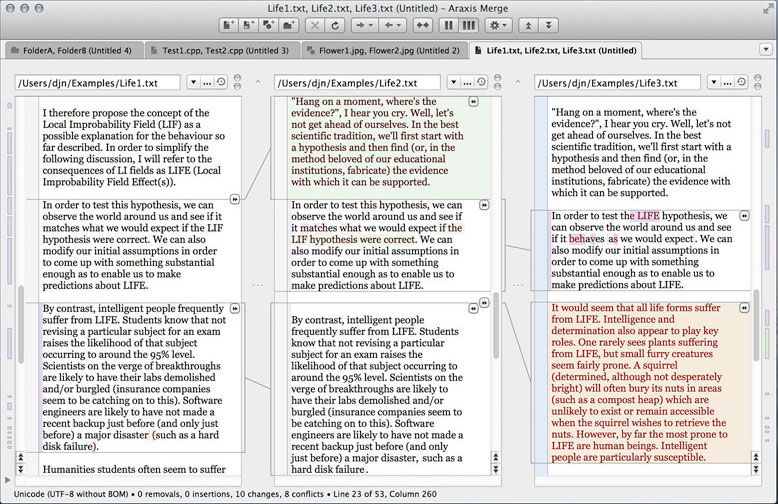

# Diff Tools on Mac OS X

Staying up-to-date in a software, writing, or design project is hard - especially when multiple people are working on it.
Without the right tools, you won't be able to understand the changes that move the project forward.
This is where a diff tool comes in handy. It makes changes visible and helps you understand them.

In this article, we've compiled a short list that helps you get an overview of the best diff tools on the Mac.

+ FileMerge
+ Kaleidoscope
+ Beyond Compare
+ Araxis Merge
+ DeltaWalker
+ P4 Merge
+ DiffMerge

### [FileMerge]()
Being part of its developer toolset, Apple's own merge tool comes at no additional costs. It might not be the most elegant tool, but it's definitely a solid one that does the job of comparing & merging text.

### [Kaleidoscope](http://www.kaleidoscopeapp.com/)
Originally developed by "Sofa", Kaleidoscope was later acquired by "BlackPixel" - who did a great job in making it one of the best diff & merge tools for the Mac. Its beautiful user interface and great image diffing capabilities are what set it apart.

### [Beyond Compare](http://www.scootersoftware.com/)
Originally a product for Microsoft Windows, the Beyond Compare team has contributed a fine diff tool to the Mac platform. Like Araxis Merge and DeltaWalker, it goes beyond (pun intended) comparing simple text and also allows diffing Word and PDF contents. In its "Pro Version", it also supports merging.

### [Araxis Merge](http://www.araxis.com/merge/)
One of the few diff tools that works with more than just text and image files, Araxis Merge lets you also compare office documents (like MS Word, Excel, Powerpoint, or ODF). For people working on both Windows and Mac, it's great to know that a single license is valid for both platforms.

### [DeltaWalker](http://www.deltawalker.com/)
Just like Araxis, the DeltaWalker app also lets you compare office files. However, it goes one step further by letting you compare file archives like ZIP, JAR, and TAR files. Also, if you're regularly performing comparisons on a folder basis, DeltaWalker shines with a great performance in this area.

### Free Alternatives
In case you're looking for a free alternative to the standard FileMerge app, you should also have a look at **[P4Merge](http://www.perforce.com/product/components/perforce-visual-merge-and-diff-tools)** and **[DiffMerge](http://www.sourcegear.com/diffmerge/)**.
Both can't compare in terms of features and user interface with their commercial competitors - but make for a valid alternative on Mac, Windows, and Linux.

### Conclusion
Diff & merge apps are amongst the most underestimated tools. But a good one can be really helpful in a lot of situations. Try one of the above and see for yourself!

#### Thanks to Tower team
[source](https://www.git-tower.com/blog/diff-tools-mac/)
